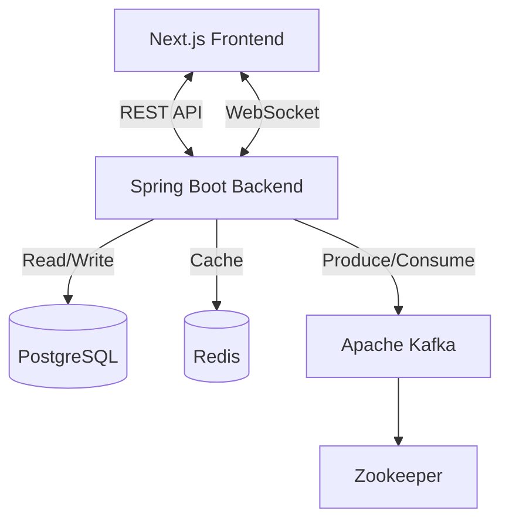

# System Architecture

## Overview
Task Manager is a full-stack application designed for personal productivity, featuring task management (Kanban), real-time updates, reminders, and habit tracking.

## Tech Stack
-   **Frontend**: Next.js 14 (React), Tailwind CSS/SCSS, SockJS, Lucide React.
-   **Backend**: Java 21, Spring Boot 3, Spring Security (JWT), Spring Data JPA, Spring WebSocket.
-   **Database**: PostgreSQL 15.
-   **Messaging**: Apache Kafka + Zookeeper (for asynchronous notifications).
-   **Caching/Session**: Redis 7.
-   **Containerization**: Docker & Docker Compose.

## Data Flow
1.  **User Action**: User updates a task on the Kanban board.
2.  **API Call**: Frontend sends a `PUT /api/tasks/{id}` request to the Backend.
3.  **Persistence**: Backend saves the change to PostgreSQL.
4.  **Event Publishing**:
    -   Backend publishes a `TaskUpdatedEvent`.
    -   A Kafka Producer sends this event to the `task-updates` topic.
5.  **Real-time Update**:
    -   A WebSocket Controller listeners for changes and broadcasts the update to subscribed clients via STOMP (`/topic/tasks/{userId}`).
6.  **Notification**:
    -   If the task has a reminder, the Notification Service schedules a Web Push notification.

## Infrastructure Diagram

